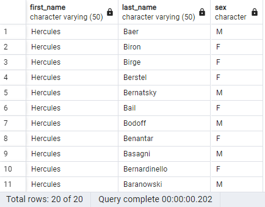

# sql-challenge
Module 9 Challenge

## Background
It is been two weeks since you were hired as a new data engineer at Pewlett Hackard (a fictional company). Your first major task is to do a research project about people whom the company employed during the 1980s and 1990s. All that remains of the employee database from that period are six CSV files.

For this project, I designed the tables to hold the data from the CSV files, import the CSV files into a SQL database, and then answer questions about the data. That is, I also perform data modeling, data engineering, and data analysis, respectively.

I started with using: [QuickDBD][https://app.quickdatabasediagrams.com/#/] in order to construct my Entity-Relationship Diagram (ERD). ERD is a visual representation used in database design to model the structure of a database. I was able to connect and find relationships between the six tables for my Primary and Foreign Keys:

My fist step, Here is a snapshot of the ERD Diagram:

The code used to write it can be found under "EmployeeSQL" folder.

Second step was to export the "Postgres SQL" schema file  of the ERD diagram above into pgAdmin 4 in order to populate all the tables.

Snap shot of the tables:

Then I imported all six CSV files to their respective tables 

third step Data Analysis part:

## Data Analysis 

## List the employee number, last name, first name, sex, and salary of each employee.

##  List the first name, last name, and hire date for the employees who were hired in 1986.

## List the manager of each department along with their department number, department name, employee number, last name, and first name.

## List the department number for each employee along with that employee s employee number, last name, first name, and department name.

## List first name, last name, and sex of each employee whose first name is Hercules and whose last name begins with the letter B.

## List each employee in the Sales department, including their employee number, last name, and first name.

## List each employee in the Sales and Development departments, including their employee number, last name, first name, and department name.

## List the frequency counts, in descending order, of all the employee last names (that is, how many employees share each last name).

